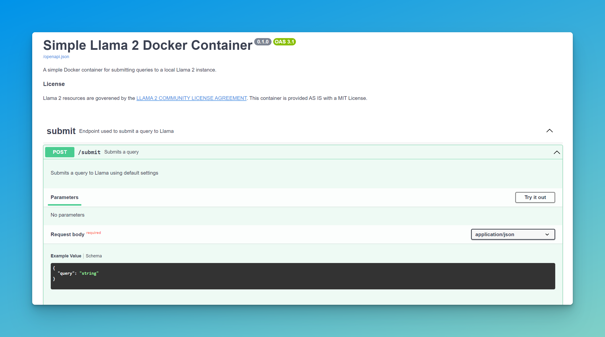
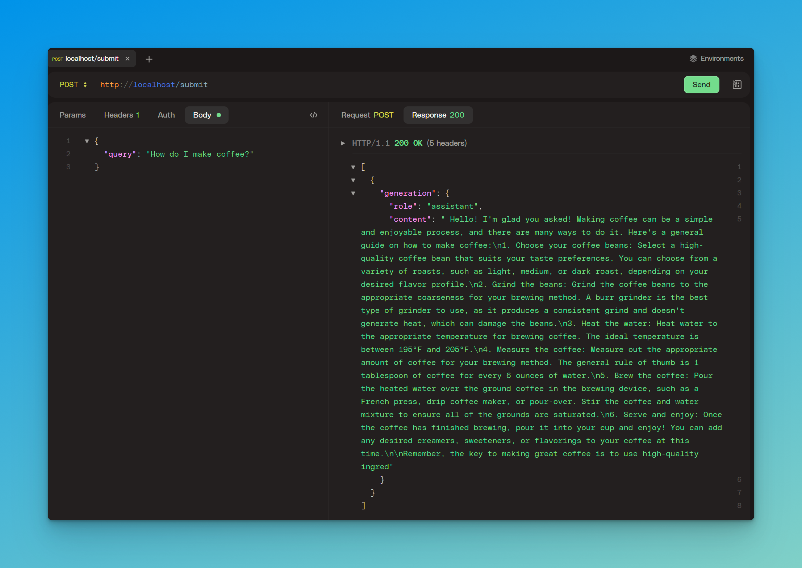

# Simple Lllama 2 Docker Container

Are you trying to just get a simple Llama2 Docker Comtainer to just work?  Welp, you might have come to the right place, as I needed the same thing, couldn't find it after Googling, and thus set this up for just that.

## What Does This Repo Do?

This repo provides a set of scripts for setting up and building a local Docker container that provides a [FastAPI](https://fastapi.tiangolo.com/) server to interact with a local Llama2 instance and an API endpoint for submitting a query to the LLM directly using default settings.  Once setup you can:

- Go to http://localhost on your local machine to use the provided [Swagger UI](https://swagger.io/tools/swagger-ui/) to send `POST` requests Llama 2:

- Directly send `POST` requests to the http://localhost/submit endpoint to directly query Llama 2 without any UI needed:

## Requirements

- A machine with a NVIDIA GPU
    - Not a Team Green or Red person, but [CUDA](https://developer.nvidia.com/cuda-toolkit) is required as per [Meta's documentation](https://github.com/facebookresearch/llama#setup).
- [Docker](https://www.docker.com/), [Git](https://git-scm.com/), and [Git LFS](https://git-lfs.com/) installed on your machine for the scripts to work
- [Successfully Requested Access](https://ai.meta.com/resources/models-and-libraries/llama-downloads/) to Llama2 from Meta using your email address
    - Meta will email you when you have been granted access
- A [Hugging Face](https://huggingface.co/) account with an email that matches the one you requested Llama2 access with (so we can use `git` to download the model weights)
- [Successfully Requested Access](https://huggingface.co/meta-llama/Llama-2-7b) to Llama2 on Hugging Face
    - Complete the steps in the `Access Llama 2 on Hugging Face` section on this page
    - Hugging Face will email you when you have been granted access
    - This process can take [1 to 2 days](https://github.com/facebookresearch/llama#access-on-hugging-face)

## Recomendations

- Set up [Git over SSH](https://huggingface.co/docs/hub/security-git-ssh) for Hugging Face so you don't have to type in credentials.

## Model Weights

This project supports the following model weights:

- [`Llama-2-7b`](https://huggingface.co/meta-llama/Llama-2-7b)
- [`Llama-2-7b-chat`](https://huggingface.co/meta-llama/Llama-2-7b-chat)
- [`Llama-2-13b`](https://huggingface.co/meta-llama/Llama-2-13b)
- [`Llama-2-13b-chat`](https://huggingface.co/meta-llama/Llama-2-13b-chat)
- [`Llama-2-70b`](https://huggingface.co/meta-llama/Llama-2-70b)
- [`Llama-2-70b-chat`](https://huggingface.co/meta-llama/Llama-2-70b-chat)

Want more?  Submit a pull request with an update.  This is GitHub; y'all know the drill.

## Instructions

- `git clone` this repo
- Run `setup.sh <weight>` with `<weight>` being the model weight you want to use
    - `Llama-2-7b-chat` is used is a weight is not provided.
    - This script will:
        - Validate the model weight
        - Ensures `git` and `git lfs` are installed
        - Check out the [Llama 2](https://github.com/facebookresearch/llama) Python Library From GitHub
        - Check out the requested model weight
    - This only needs to be done once per model weight.
- Run `start.sh <weight>` with `<weight>` being the model weight you want to use
    - `Llama-2-7b-chat` is used is a weight is not provided.
    - This script will build and start the Docker container using [docker compose](https://docs.docker.com/compose/).
- Go to http://localhost to use the [Swagger UI](https://swagger.io/tools/swagger-ui/) to send a request to the `/submit` endpoint to submit a query or send a `POST` request to the `/submit` endpoint directly.

From here, feel free to start hacking what I've got here and customizing things to your needs.  I've tried to comment all this to explain what's going on but this is just a base to get started.

## License

Llama 2 resources are governed by the [LLAMA 2 COMMUNITY LICENSE AGREEMENT](https://github.com/facebookresearch/llama/blob/main/LICENSE).

The custom code in this repo is governed by [The MIT License](https://opensource.org/license/mit/)